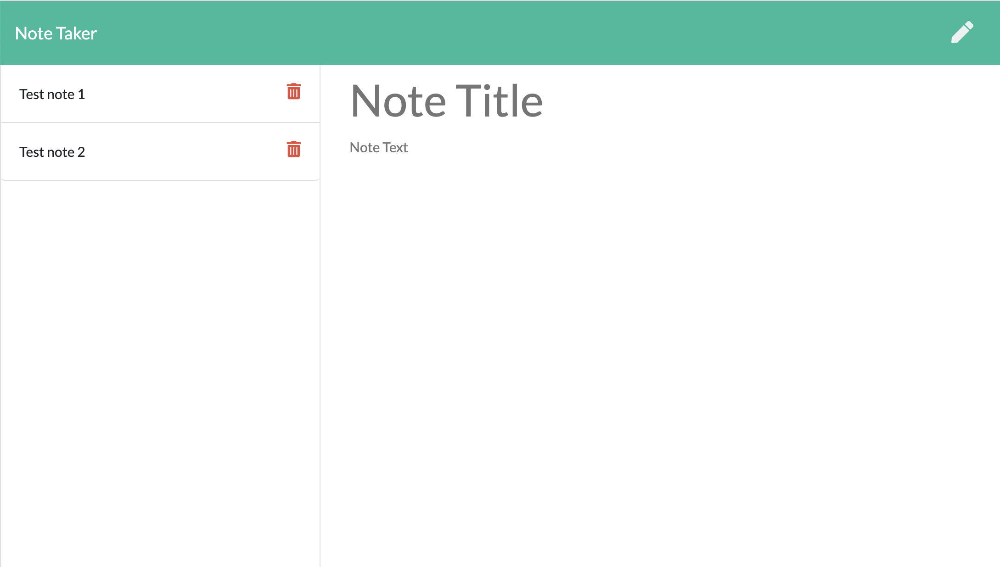
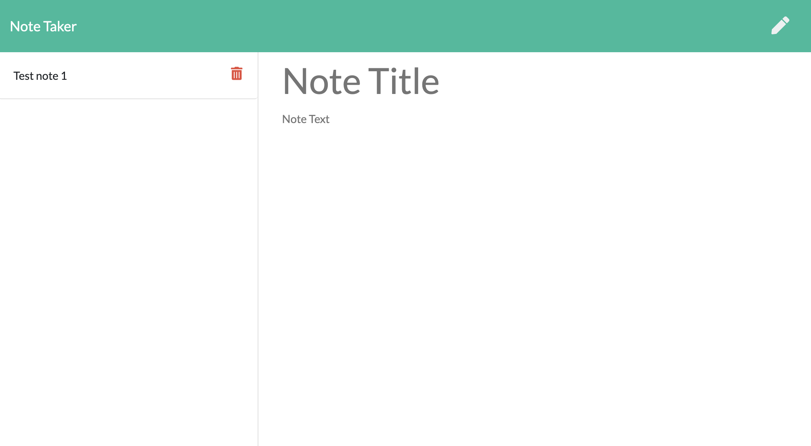

# Note Taker

  

  ## Description
  Write notes and save them for later. Click on the delete button next to a note to delete from the apps memory.

  ## Table of Contents
  - [Installation](#installation)
  - [Usage](#usage)
  - [How to contribute](#contribute)
  
  - [License](#license)
  - [Questions](#questions)

  ## Installation
  run 'npm i'

  ## Usage
  To run locally 'node server'. To use the deployed app go here: https://hidden-sands-80026.herokuapp.com/notes

  ## Screenshot 
  
    

  ## Contribute
  Send me an email: watts.e.michelle@gmail.com

  

  ## License

Permission is hereby granted, free of charge, to any person obtaining a copy of this software and associated documentation files, to deal in the Software without restriction, including without limitation the rights to use, copy, modify, merge, publish, distribute, sublicense, and/or sell copies of the Software.

  ## Questions
  [Github: michellewatts20000](https://github.com/michellewatts20000)
   
  [Email: watts.e.michelle@gmail.com](mailto:watts.e.michelle@gmail.com)
